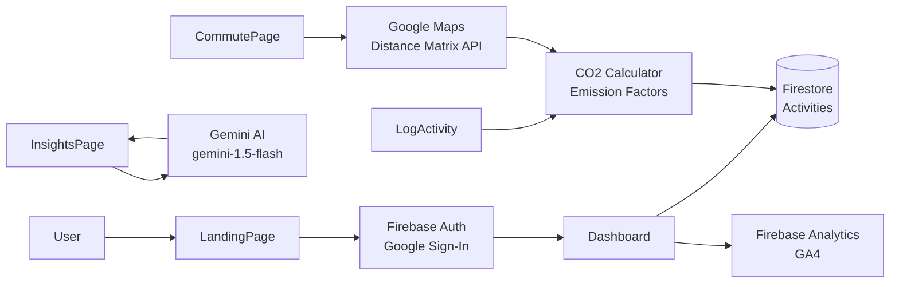

# Architecture

CarbonWise follows a component-based architecture organized around feature pages and global providers. Business logic is strictly separated from the presentation layer.

## System Diagram

## Layers

### Auth Layer

Managed by `Firebase Authentication` and exposed via the React Context API (`AuthContext.tsx`). The `ProtectedRoute` component ensures that unauthenticated users attempting to access the dashboard or other internal pages are redirected to the `LandingPage`. User state (including uid, display name, and avatar) is available globally via the `useAuth` hook.

### Data Layer

Managed by `Firebase Firestore` and encapsulated in `activityService.ts`. The schema uses collections for `users` and `activities`. To prevent excessive reads, aggregate `dailySummaries` can be tracked, though currently, queries leverage timestamp indices to fetch the last 7 days of activities efficiently. All Firestore logic is fully mocked in tests.

### Calculation Engine

The core of the application resides in `co2Calculator.ts`. This engine is composed entirely of pure functions. It accepts raw activity data (e.g., "15 km in a petrol car", "1 beef meal") and applies deterministic emission factors to output the total CO2 equivalent in kilograms. This strict separation allows for exhaustive unit testing.

### AI Layer

The `geminiService.ts` handles communication with the Google Gemini REST API (`gemini-1.5-flash`). It abstracts the prompt construction, taking the user's historical activity data and formulating a context-rich prompt. The service returns a conversational response that the `InsightsPage` renders as a chat interface.

### Maps Layer

The `mapsService.ts` integrates with the Google Maps Distance Matrix API. Given a raw string origin and destination, it calculates the driving or transit distance. The `CommutePage` passes this output into the Calculation Engine to determine the exact emissions of the commute.
